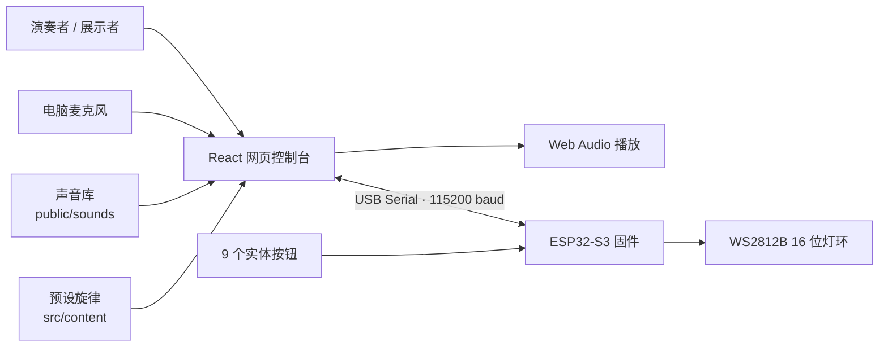

<div align="center">

<p>
  <strong>简体中文</strong> ·
  <a href="./README_EN.md">English</a>
</p>

# AI Builder Sound Instrument

### 把一段角色声音，变成能按键演奏、自动生成旋律、并用灯环回应你的实体小乐器

一个面向小红书 AI Builder 活动的可运行 MVP：React 网页负责采样、变调、旋律生成与演奏；ESP32-S3 负责实体按钮和 WS2812B 灯环。  
评审不需要读完代码，打开页面、按下按键、听到声音、看到灯光，就能明白这个项目完成了什么。

<p>
  
  
  
  
  
  
</p>

<p>
  <a href="#demo-gallery">项目截图</a> ·
  <a href="#quick-start">快速开始</a> ·
  <a href="#hardware">硬件方案</a> ·
  <a href="#content-workflow">内容接入</a> ·
  <a href="#docs">文档索引</a>
</p>


</div>

---

## 一句话演示

```text
选择/录制一个声音 -> 映射成 C D E F G A B -> 用网页或实体按钮演奏 -> 生成短旋律 -> 灯环同步亮起
```

这不是一个普通音频播放器。它是一套完整的小型交互乐器原型：声音可以被采样，角色可以被切换，旋律可以被生成，硬件可以真实响应。

## 项目亮点

| 评审看到的瞬间 | 我们实际完成的能力 |
|---|---|
| 页面像一台完整的“精灵合奏台” | React + Vite 实现可演奏控制台，而不是临时按钮页 |
| 点击角色，音色马上变化 | 多音色库、单音节采样、基准音校准、增益和裁切参数 |
| 按 `C-D-E-G` 可以组成动机 | Web Audio 播放、音高映射、动机缓存 |
| 点击 `生成旋律` 有完整乐句 | 基于动机和预设曲库的稳定生成逻辑 |
| 插上 ESP32 后实体按钮可控 | Web Serial 协议、9 键输入、硬件日志 |
| 按键时灯环跟随反馈 | WS2812B 状态灯效、音符颜色、录音/生成/播放状态 |

<a id="demo-gallery"></a>

## 项目截图

### 1. 主演奏台

角色、舞台、7 个音阶键、硬件连接区和串口日志集中在同一个演奏界面里。


### 2. 多音色舞台

左侧可以切换不同角色音色，舞台会同步展示当前选中的角色。


### 3. 音乐动机生成

点击音阶键后，页面会记录最近动机，并用它生成更完整的旋律。


### 4. 自定义嘉宾声音

`神秘嘉宾` 入口支持录制一个新的短声音，把现场声音加入演奏。


## 当前已实现

- **网页演奏**：点击 `C D E F G A B` 直接播放当前音色。
- **键盘/实体按钮双入口**：没有硬件时也能用网页演示；接上 ESP32 后可以用实体按钮演示。
- **多角色音色**：已接入 `圆号鱼`、`猴麦仔`、`里拉鳐`、`小夜`、`恶魔叮` 等采样。
- **单音节调音**：优先使用短、干净、可测基频的采样，减少“一个键响两个音节”的问题。
- **预设旋律**：包含 `人鱼湾 正谱`、`彼得大道 Vocal` 等适合展示的曲目。
- **新增声音**：录制短音频，作为新的演奏音色进入流程。
- **灯光反馈**：音符、录音、生成、播放、彩虹和熄灭状态都能发送给 WS2812B。
- **交接文档**：硬件接法、串口协议、内容格式和团队分工都有独立文档。

## 系统架构



<a id="hardware"></a>

## 硬件方案

| 硬件 | 数量 | 作用 |
|---|---:|---|
| ESP32-S3 开发板 | 1 | 主控，读取按钮、控制灯环、通过 USB 串口连接网页 |
| Gravity / 数字按钮 | 9 | 7 个音阶键 + 录音键 + 生成键 |
| WS2812B 16 位灯环 | 1 | 根据音符和状态显示灯效 |
| 面包板 / 杜邦线 | 1 套 | 快速搭建和调整接线 |
| USB-C 数据线 | 1 | 供电 + 串口通信 |

当前固件消息：

| 动作 | 串口文本 |
|---|---|
| 音阶键 | `NOTE:C` / `NOTE:D` / `NOTE:E` / `NOTE:F` / `NOTE:G` / `NOTE:A` / `NOTE:B` |
| 录音键 | `REC` |
| 生成键 | `GENERATE` |
| 灯环信号脚 | `GPIO14` |
| 波特率 | `115200` |

### 接线参考

| GPIO14 灯环接线 | 最简面包板 MVP | 完整面包板参考 |
|---|---|---|
|  |  |  |

更多硬件细节：

- [标准硬件接线](docs/HARDWARE_WIRING.md)
- [实际演示交接文档，包含救急直插 GPIO 表](docs/HARDWARE_INTERFACE_HANDOFF_CN.md)
- [USB 串口协议](docs/SERIAL_PROTOCOL.md)

<a id="quick-start"></a>

## 快速开始

### 运行网页端

```bash
cd desktop-app
npm install
npm run dev
```

当前交接版本通常固定端口运行：

```bash
npm run dev -- --host 127.0.0.1 --port 5174
```

使用 Chrome 或 Edge 打开：

```text
http://127.0.0.1:5174/
```

Safari 不支持 Web Serial，因此不能用于硬件连接流程。

### 无硬件测试

1. 在左侧选择一个角色音色。
2. 点击网页上的 `C D E F G A B` 音阶卡片。
3. 连续点击几个音符录入短动机。
4. 点击 `生成旋律`。
5. 打开 `神秘嘉宾`，测试自定义录音弹窗。

### 连接 ESP32-S3

1. 用 USB-C 数据线把 ESP32-S3 接到 Mac。
2. 使用 Chrome 或 Edge 打开网页。
3. 点击 `Connect Hardware / 连接硬件`。
4. 选择 ESP32 串口设备。
5. 按实体按钮，检查右侧串口日志：

```text
IN NOTE:C
IN NOTE:D
IN REC
IN GENERATE
```

## 固件

固件路径：

```text
firmware/esp32-s3-controller
```

构建：

```bash
cd firmware/esp32-s3-controller
pio run
```

烧录：

```bash
pio run --target upload
```

如果 Chrome 已经连接了 ESP32 串口，需要先在网页里断开连接，再烧录固件。

<a id="content-workflow"></a>

## 内容接入

声音文件放在：

```text
desktop-app/public/sounds/
```

可演奏音色登记在：

```text
desktop-app/src/content/soundLibrary.ts
```

预设旋律登记在：

```text
desktop-app/src/content/presetMelodies.ts
```

推荐声音格式：

| 字段 | 建议 |
|---|---|
| 格式 | 首选 `.wav`；也支持 `.mp3`、`.webm`、`.ogg` |
| 采样率 | 44.1 kHz 或 48 kHz |
| 声道 | 优先单声道，双声道也可接入 |
| 长度 | 理想 0.3-1.2 秒，最多不超过 3 秒 |
| 命名 | 新增公开素材建议使用小写英文短横线 |

音色配置示例：

```ts
{
  id: 'cat-meow',
  name: 'Cat Meow',
  file: '/sounds/cat-meow-c4.wav',
  baseNote: 'C',
  trimStartMs: 20,
  trimEndMs: 780,
  gain: 0.85,
  enabled: true,
  tags: ['animal', 'bright']
}
```

旋律事件示例：

```ts
{ note: 'C', durationMs: 240, velocity: 0.95 }
```

团队交接：

- [内容接入文档](docs/CONTENT_HANDOFF.md)
- [中文团队分工](docs/TEAM_SPLIT_CN.md)

## 仓库结构

```text
.
├── desktop-app/                     # Vite + React 网页控制台
│   ├── public/                      # UI 素材和声音文件
│   └── src/content/                 # 音色配置和预设旋律
├── firmware/esp32-s3-controller/    # ESP32-S3 Arduino / PlatformIO 固件
├── docs/                            # 接线、串口协议、交接文档
├── docs/screenshots/                # README 展示截图
├── DFRobot 完整采购清单.md           # MVP 硬件采购清单
└── 洛克王国精灵声音 DIY 演奏小乐器.md
```

## 验证

网页构建：

```bash
cd desktop-app
npm run build
```

固件构建：

```bash
cd firmware/esp32-s3-controller
pio run
```

演示验收清单：

- 网页能在 Chrome/Edge 本地打开。
- 网页音阶键能播放当前音色。
- `神秘嘉宾` 能打开并录制短采样。
- ESP32 能发送 `NOTE:*`、`REC`、`GENERATE`。
- WS2812B 能响应 `LED:*` 指令。

<a id="docs"></a>

## 文档索引

| 文档 | 说明 |
|---|---|
| [MVP 范围](docs/MVP_SCOPE.md) | 当前包含和暂缓的功能 |
| [实现计划](docs/IMPLEMENTATION_PLAN.md) | 工程计划和实现记录 |
| [串口协议](docs/SERIAL_PROTOCOL.md) | USB 串口消息格式 |
| [硬件接线](docs/HARDWARE_WIRING.md) | 标准接线参考 |
| [硬件交接文档](docs/HARDWARE_INTERFACE_HANDOFF_CN.md) | 实际演示接线和代码变更原因 |
| [内容交接](docs/CONTENT_HANDOFF.md) | 声音文件和预设旋律格式 |
| [团队分工](docs/TEAM_SPLIT_CN.md) | 同学协作方式和内容口径 |

## 项目边界

这个项目刻意保持本地优先、演示稳定：

- 不需要云后端
- 不需要账号系统
- 不依赖外部 AI 音乐服务
- 不需要电池、蓝牙、SD 卡、功放或硬件扬声器
- 不公开分发未经授权的官方游戏素材

这个范围是有意控制的：电脑负责音频，ESP32 负责实体交互，项目才能稳定完成现场展示。
