<div align="center">

# AI Builder Sound Instrument

### 把一段角色声音，变成能按键演奏、自动生成旋律、并用灯环回应你的实体小乐器

一个面向 XiaoHongShu AI Builder 活动的可运行 MVP：React 网页负责采样、变调、旋律生成与演奏；ESP32-S3 负责实体按钮和 WS2812B 灯环。  
评审不需要读完代码，打开页面、按下按键、听到声音、看到灯光，就能明白这个项目完成了什么。

<p>
  
  
  
  
  
  
</p>

<p>
  <a href="#demo-gallery">Demo Gallery</a> ·
  <a href="#quick-start">Quick Start</a> ·
  <a href="#hardware">Hardware</a> ·
  <a href="#content-workflow">Content Workflow</a> ·
  <a href="#docs">Docs</a>
</p>


</div>

---

## The One-Line Demo

```text
选择/录制一个声音 -> 映射成 C D E F G A B -> 用网页或实体按钮演奏 -> 生成短旋律 -> 灯环同步亮起
```

这不是一个普通音频播放器。它是一套完整的小型交互乐器原型：声音可以被采样，角色可以被切换，旋律可以被生成，硬件可以真实响应。

## Why It Stands Out

| 评审看到的瞬间 | 我们实际完成的能力 |
|---|---|
| 页面像一台完整的“精灵合奏台” | React + Vite 实现可演奏控制台，而不是临时按钮页 |
| 点击角色，音色马上变化 | 多音色库、单音节采样、基准音校准、增益和裁切参数 |
| 按 `C-D-E-G` 可以组成动机 | Web Audio 播放、音高映射、动机缓存 |
| 点击 `生成旋律` 有完整乐句 | 基于动机和预设曲库的稳定生成逻辑 |
| 插上 ESP32 后实体按钮可控 | Web Serial 协议、9 键输入、硬件日志 |
| 按键时灯环跟随反馈 | WS2812B 状态灯效、音符颜色、录音/生成/播放状态 |

## Demo Gallery

### 1. Main Console

角色、舞台、7 个音阶键、硬件连接区和串口日志在同一个演奏界面里。


### 2. Multi-Timbre Stage

左侧可以切换不同角色音色，舞台会同步展示当前选中的角色。


### 3. Motif Builder

点击音阶键后，页面会记录最近动机，并用它生成更完整的旋律。


### 4. Custom Guest Sound

`神秘嘉宾` 入口支持录制一个新的短声音，把现场声音加入演奏。


## What Works Today

- **网页演奏**：点击 `C D E F G A B` 直接播放当前音色。
- **键盘/实体按钮双入口**：没有硬件时也能用网页演示；接上 ESP32 后可以用实体按钮演示。
- **多角色音色**：已接入 `圆号鱼`、`猴麦仔`、`里拉鳐`、`小夜`、`恶魔叮` 等采样。
- **单音节调音**：优先使用短、干净、可测基频的采样，减少“一个键响两个音节”的问题。
- **预设旋律**：包含 `人鱼湾 正谱`、`彼得大道 Vocal` 等适合展示的曲目。
- **新增声音**：录制短音频，作为新的演奏音色进入流程。
- **灯光反馈**：音符、录音、生成、播放、彩虹和熄灭状态都能发送给 WS2812B。
- **交接文档**：硬件接法、串口协议、内容格式和团队分工都有独立文档。

## Architecture

```mermaid
flowchart LR
  Player["Presenter / Player"] --> UI["React Desktop Console"]
  Mic["Computer Microphone"] --> UI
  Library["Sound Library<br/>public/sounds"] --> UI
  Presets["Preset Melodies<br/>src/content"] --> UI
  UI --> Audio["Web Audio Playback"]
  UI <-->|"USB Serial · 115200 baud"| ESP["ESP32-S3 Firmware"]
  Buttons["9 Physical Buttons"] --> ESP
  ESP --> LED["WS2812B 16-LED Ring"]
```



## Hardware

| Part | Quantity | Why It Is Needed |
|---|---:|---|
| ESP32-S3 DevKit | 1 | 主控，读取按钮、控制灯环、通过 USB 串口连网页 |
| Gravity / digital buttons | 9 | 7 个音阶键 + 录音键 + 生成键 |
| WS2812B 16-LED ring | 1 | 根据音符和状态显示灯效 |
| Breadboard / jumper wires | 1 set | 快速搭建和调整接线 |
| USB-C data cable | 1 | 供电 + 串口通信 |

Current firmware messages:

| Action | Serial Line |
|---|---|
| Note C-G/A/B | `NOTE:C` / `NOTE:D` / `NOTE:E` / `NOTE:F` / `NOTE:G` / `NOTE:A` / `NOTE:B` |
| Record | `REC` |
| Generate | `GENERATE` |
| LED signal pin | `GPIO14` |
| Baud rate | `115200` |

### Wiring References

| GPIO14 LED Wiring | Simple Breadboard MVP | Full Breadboard Reference |
|---|---|---|
|  |  |  |

More detail:

- [Standard hardware wiring](docs/HARDWARE_WIRING.md)
- [Actual demo handoff, including emergency direct-plug GPIO map](docs/HARDWARE_INTERFACE_HANDOFF_CN.md)
- [USB serial protocol](docs/SERIAL_PROTOCOL.md)

## Quick Start

### Run the Web App

```bash
cd desktop-app
npm install
npm run dev
```

For the current demo handoff, we usually pin the port:

```bash
npm run dev -- --host 127.0.0.1 --port 5174
```

Open in Chrome or Edge:

```text
http://127.0.0.1:5174/
```

Safari is not supported because the hardware flow uses Web Serial.

### Test Without Hardware

1. Select a character in the left sidebar.
2. Click the on-screen `C D E F G A B` note cards.
3. Enter a short motif by playing several notes.
4. Click `生成旋律`.
5. Open `神秘嘉宾` and test the custom recording modal.

### Connect ESP32-S3

1. Plug ESP32-S3 into the Mac with a USB-C data cable.
2. Open the app in Chrome or Edge.
3. Click `Connect Hardware / 连接硬件`.
4. Choose the ESP32 serial device.
5. Press physical buttons and check the serial log:

```text
IN NOTE:C
IN NOTE:D
IN REC
IN GENERATE
```

## Firmware

Firmware path:

```text
firmware/esp32-s3-controller
```

Build:

```bash
cd firmware/esp32-s3-controller
pio run
```

Upload:

```bash
pio run --target upload
```

If Chrome is connected to the ESP32 serial port, disconnect it before uploading firmware.

## Content Workflow

Sound files:

```text
desktop-app/public/sounds/
```

Playable sound registry:

```text
desktop-app/src/content/soundLibrary.ts
```

Preset melody registry:

```text
desktop-app/src/content/presetMelodies.ts
```

Recommended sample format:

| Field | Recommendation |
|---|---|
| Format | `.wav` preferred; `.mp3`, `.webm`, `.ogg` accepted |
| Sample rate | 44.1 kHz or 48 kHz |
| Channels | Mono preferred, stereo accepted |
| Length | 0.3-1.2 seconds ideal, no more than 3 seconds |
| Naming | lowercase kebab-case for new public assets |

Sound preset shape:

```ts
{
  id: 'cat-meow',
  name: 'Cat Meow',
  file: '/sounds/cat-meow-c4.wav',
  baseNote: 'C',
  trimStartMs: 20,
  trimEndMs: 780,
  gain: 0.85,
  enabled: true,
  tags: ['animal', 'bright']
}
```

Melody event shape:

```ts
{ note: 'C', durationMs: 240, velocity: 0.95 }
```

Team handoff:

- [Content handoff](docs/CONTENT_HANDOFF.md)
- [Team split CN](docs/TEAM_SPLIT_CN.md)

## Repository Map

```text
.
├── desktop-app/                     # Vite + React web console
│   ├── public/                      # UI assets and sound files
│   └── src/content/                 # Sound presets and melody presets
├── firmware/esp32-s3-controller/    # ESP32-S3 Arduino / PlatformIO firmware
├── docs/                            # Wiring, serial protocol, handoff docs
├── docs/screenshots/                # README screenshots
├── DFRobot 完整采购清单.md           # MVP purchase list
└── 洛克王国精灵声音 DIY 演奏小乐器.md
```

## Validation

Web build:

```bash
cd desktop-app
npm run build
```

Firmware build:

```bash
cd firmware/esp32-s3-controller
pio run
```

Demo acceptance checklist:

- The web app opens locally in Chrome/Edge.
- On-screen notes play the selected timbre.
- `神秘嘉宾` opens and records a short sample.
- ESP32 sends `NOTE:*`, `REC`, and `GENERATE`.
- WS2812B responds to `LED:*` commands.

## Docs

| Document | What It Answers |
|---|---|
| [MVP scope](docs/MVP_SCOPE.md) | What is included and intentionally deferred |
| [Implementation plan](docs/IMPLEMENTATION_PLAN.md) | Engineering plan and build notes |
| [Serial protocol](docs/SERIAL_PROTOCOL.md) | Exact USB serial messages |
| [Hardware wiring](docs/HARDWARE_WIRING.md) | Standard wiring reference |
| [Hardware handoff CN](docs/HARDWARE_INTERFACE_HANDOFF_CN.md) | Actual demo wiring and code-change handoff |
| [Content handoff](docs/CONTENT_HANDOFF.md) | Sound file and melody preset format |
| [Team split CN](docs/TEAM_SPLIT_CN.md) | Team division and content workflow |

## Boundaries

This project is intentionally local-first and demo-stable:

- no cloud backend
- no account system
- no external AI music service required
- no battery, Bluetooth, SD card, amplifier, or hardware speaker required
- no public redistribution of unlicensed official game assets

That scope is deliberate: the computer handles audio, ESP32 handles physical interaction, and the project stays reliable enough for a live presentation.
