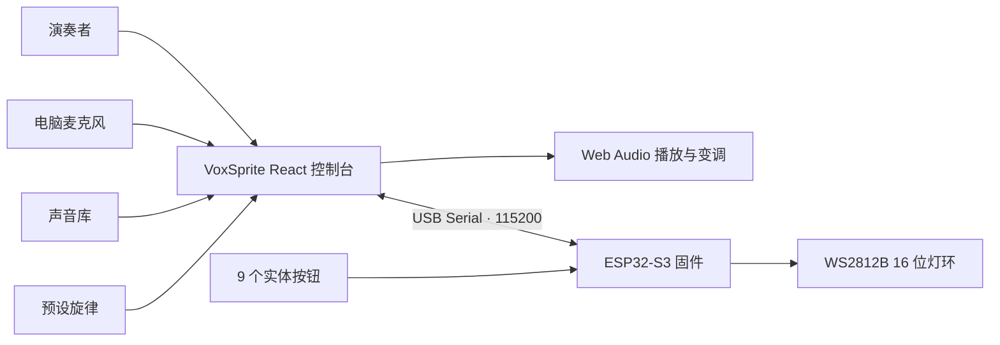

<div align="center">

<p>
  <strong>简体中文</strong> ·
  <a href="./README_EN.md">English</a>
</p>


# VoxSprite · 声灵

### 让每一种声音，都能成为会演奏的精灵。

只需一段短声音，VoxSprite 就能把它映射成七个音阶；你可以在网页上演奏，也可以接入 ESP32-S3 实体按键，并让 WS2812B 灯环实时回应每个音符。

<p>
  <a href="https://github.com/Jackey0903/VoxSprite/stargazers"></a>
  
  
  
  
  
</p>

<p>
  <a href="#demo">演示</a> ·
  <a href="#quick-start">快速开始</a> ·
  <a href="#hardware">硬件</a> ·
  <a href="#content-workflow">内容接入</a> ·
  <a href="#documentation">文档</a>
</p>


</div>

## 一眼看懂

```text
选择或录制一段声音 -> 映射到 C D E F G A B -> 网页或实体按键演奏 -> 生成旋律 -> 灯环同步回应
```

VoxSprite 不是普通音频播放器，而是一套从**声音采样**到**音高映射**、从**旋律演奏**到**实体反馈**的完整交互乐器。电脑负责声音和创作界面，ESP32-S3 负责手能按到的按键与看得见的灯光。

## 为什么是 VoxSprite

`Vox` 是声音，`Sprite` 是精灵。每一段被录下的声音都会成为一个可切换、可调音、可演奏的“声灵”。

| 你会看到 | 它背后的实现 |
|---|---|
| 录下一声短促的发音，马上弹成七个音 | Web Audio 解码、基准音校准、变调、裁切和增益控制 |
| 切换精灵，整套键盘随即换一种音色 | 数据驱动的多采样音色库 |
| 输入几个音，生成一段完整乐句 | 动机缓存、规则生成与预设旋律系统 |
| 按实体键，网页和灯环同时响应 | Web Serial、ESP32-S3、9 键输入与 WS2812B 状态协议 |
| 没有硬件也能完整体验 | 屏幕按键、键盘快捷键和本地录音回退 |

<a id="demo"></a>

## 演示

<table>
  <tr>
    <td width="50%"><br/><strong>主演奏台</strong><br/>角色、舞台、音阶、硬件连接和串口日志集中在一个界面。</td>
    <td width="50%"><br/><strong>多音色声灵</strong><br/>切换角色时，音色、舞台和当前采样一起变化。</td>
  </tr>
  <tr>
    <td width="50%"><br/><strong>动机与旋律</strong><br/>记录刚刚弹奏的音符，并将它扩展成可重复播放的乐句。</td>
    <td width="50%"><br/><strong>自定义声音</strong><br/>现场录制短采样，把自己的声音加入演奏。</td>
  </tr>
</table>

## 当前能力

- **一声变七音**：将短采样映射到 `C D E F G A B`，支持跨八度与双采样区间。
- **多角色音色**：已接入多组短音节采样，并为每个音色配置基准音、裁切和增益。
- **动机生成旋律**：先弹一段短动机，再由稳定的本地规则生成完整乐句。
- **预设曲目演奏**：支持旋律、速度、力度、八度和伴奏配置。
- **现场新增声音**：通过电脑麦克风录制新声音并立即试弹。
- **软硬件双入口**：页面、电脑键盘和 9 个实体按键共享同一套交互。
- **实时灯光反馈**：灯环显示音符、录音、生成、播放、彩虹与熄灭状态。
- **本地优先**：不需要云后端、账号或外部音乐生成服务，断网也能演示。

<a id="quick-start"></a>

## 快速开始

### 1. 获取并运行

需要 Node.js 18+，推荐使用 Chrome 或 Edge。

```bash
git clone https://github.com/Jackey0903/VoxSprite.git
cd VoxSprite/desktop-app
npm install
npm run dev
```

打开终端显示的本地地址。若需要与当前硬件交接环境保持一致：

```bash
npm run dev -- --host 127.0.0.1 --port 5174
```

然后访问 `http://127.0.0.1:5174/`。

> Safari 不支持 Web Serial。纯网页演奏可以使用 Safari，但连接 ESP32-S3 请使用 Chrome 或 Edge。

### 2. 没有硬件也能体验

1. 从左侧选择一个声灵音色。
2. 点击 `C D E F G A B`，或使用键盘 `1-7` 演奏。
3. 连续输入几个音符形成短动机。
4. 点击 `生成旋律`，试听扩展后的乐句。
5. 打开 `神秘嘉宾`，录制并测试自己的短声音。

### 3. 连接实体乐器

1. 用 USB-C 数据线将 ESP32-S3 连接到电脑。
2. 在 Chrome 或 Edge 中打开 VoxSprite。
3. 点击 `连接硬件`，选择 ESP32 对应串口。
4. 按实体按钮，在串口日志中确认 `IN NOTE:C`、`IN REC` 或 `IN GENERATE`。

## 系统架构



设计边界很清楚：**电脑处理声音，ESP32 处理实体交互。** 这让 MVP 保持低成本、可调试，也更适合现场展示。

<a id="hardware"></a>

## 硬件

| 硬件 | 数量 | 作用 |
|---|---:|---|
| ESP32-S3 开发板 | 1 | 读取按钮、控制灯环、通过 USB 串口连接网页 |
| Gravity / 数字按钮 | 9 | 7 个音阶键 + 录音键 + 生成键 |
| WS2812B 16 位灯环 | 1 | 显示音符和系统状态 |
| 面包板与杜邦线 | 1 套 | 快速搭建和调整接线 |
| USB-C 数据线 | 1 | 供电与串口通信 |

### 当前固件接口

| 动作 | 串口文本或参数 |
|---|---|
| 音阶键 | `NOTE:C` / `NOTE:D` / `NOTE:E` / `NOTE:F` / `NOTE:G` / `NOTE:A` / `NOTE:B` |
| 录音键 | `REC` |
| 生成键 | `GENERATE` |
| 灯环信号脚 | `GPIO14` |
| 波特率 | `115200` |

| GPIO14 灯环接线 | 最简面包板 MVP | 完整面包板参考 |
|---|---|---|
|  |  |  |

固件位于 `firmware/esp32-s3-controller/`：

```bash
cd firmware/esp32-s3-controller
pio run
pio run --target upload
```

烧录前请先断开网页对串口的占用。

<a id="content-workflow"></a>

## 内容接入

声音和旋律与核心代码分离，方便团队成员独立协作：

| 内容 | 位置 |
|---|---|
| 声音文件 | `desktop-app/public/sounds/` |
| 音色登记 | `desktop-app/src/content/soundLibrary.ts` |
| 预设旋律 | `desktop-app/src/content/presetMelodies.ts` |

推荐采样口径：

| 字段 | 建议 |
|---|---|
| 格式 | 首选 `.wav`；也支持 `.mp3`、`.webm`、`.ogg` |
| 采样率 | 44.1 kHz 或 48 kHz |
| 声道 | 单声道优先 |
| 长度 | 理想为 0.3-1.2 秒，最多不超过 3 秒 |
| 内容 | 单音节、起音清楚、背景干净、无混响拖尾 |

```ts
// desktop-app/src/content/soundLibrary.ts
{
  id: 'cat-meow',
  name: 'Cat Meow',
  file: '/sounds/cat-meow-c4.wav',
  baseNote: 'C',
  trimStartMs: 20,
  trimEndMs: 780,
  gain: 0.85,
  enabled: true,
  tags: ['animal', 'bright']
}
```

旋律事件保持简单、可读：

```ts
{ note: 'C', durationMs: 240, velocity: 0.95 }
```

## 仓库结构

```text
VoxSprite/
├── desktop-app/                     # Vite + React 演奏控制台
│   ├── public/sounds/               # 声音与伴奏文件
│   └── src/content/                 # 音色和预设旋律配置
├── firmware/esp32-s3-controller/    # ESP32-S3 / PlatformIO 固件
├── docs/                            # 接线、协议与团队交接文档
├── docs/screenshots/                # README 真实界面截图
└── DFRobot 完整采购清单.md           # MVP 硬件采购清单
```

## 验证

```bash
cd desktop-app
npm run build
```

```bash
cd firmware/esp32-s3-controller
pio run
```

演示通过标准：网页音阶可发声、自定义录音可用、ESP32 能发送 `NOTE:*` / `REC` / `GENERATE`，灯环能响应 `LED:*` 指令。

<a id="documentation"></a>

## 文档

| 文档 | 内容 |
|---|---|
| [MVP 范围](docs/MVP_SCOPE.md) | 当前包含与暂缓的功能 |
| [实现计划](docs/IMPLEMENTATION_PLAN.md) | 工程计划和实现记录 |
| [串口协议](docs/SERIAL_PROTOCOL.md) | USB 串口消息格式 |
| [硬件接线](docs/HARDWARE_WIRING.md) | 标准接线参考 |
| [硬件交接](docs/HARDWARE_INTERFACE_HANDOFF_CN.md) | 实际演示接线和代码变更原因 |
| [内容交接](docs/CONTENT_HANDOFF.md) | 声音文件和预设旋律格式 |
| [团队分工](docs/TEAM_SPLIT_CN.md) | 团队协作方式和参数口径 |

## 项目边界

VoxSprite 诞生于小红书 AI Builder 活动，目前是一个本地优先的可演示 MVP。它不需要云后端、账号、蓝牙、SD 卡、功放或硬件扬声器；旋律生成采用可复现的本地规则与预设，不声称使用完整 AI 音乐模型。

项目不鼓励公开分发未经授权的游戏音频或角色素材。新增内容应优先使用原创、团队录制或获得授权的素材。

---

<div align="center">

**VoxSprite · 声灵** — 录下一声，让它开始演奏。

</div>
