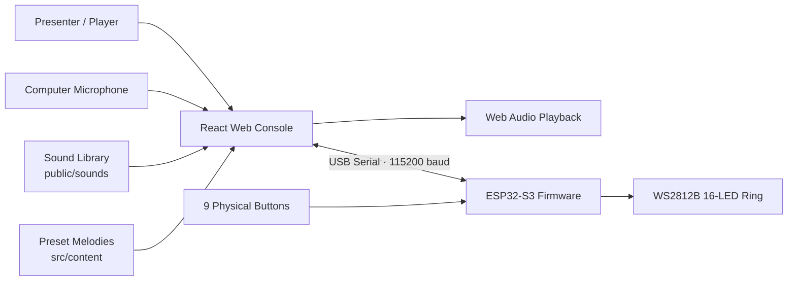

<div align="center">

<p>
  <a href="./README.md">简体中文</a> ·
  <strong>English</strong>
</p>

# AI Builder Sound Instrument

### Turn a character voice into a playable physical instrument with generated melodies and reactive LED feedback.

A working MVP for the XiaoHongShu AI Builder activity: the React web app handles sampling, pitch shifting, melody generation, and playback; the ESP32-S3 reads physical buttons and drives a WS2812B LED ring.  
The demo is designed to be understood immediately: open the app, press a key, hear the sound, and watch the hardware respond.

<p>
  
  
  
  
  
  
</p>

<p>
  <a href="#demo-gallery">Demo Gallery</a> ·
  <a href="#quick-start">Quick Start</a> ·
  <a href="#hardware">Hardware</a> ·
  <a href="#content-workflow">Content Workflow</a> ·
  <a href="#docs">Docs</a>
</p>


</div>

---

## One-Line Demo

```text
Choose or record a sound -> map it to C D E F G A B -> play it on screen or with hardware -> generate a phrase -> sync LED feedback
```

This is not just an audio player. It is a compact interactive instrument prototype: sounds can be sampled, characters can be switched, melodies can be generated, and the hardware reacts in real time.

## Why It Stands Out

| What reviewers see | What the project actually does |
|---|---|
| A polished “sprite ensemble stage” instead of a plain demo page | A React + Vite performance console built for presentation |
| Switching a character changes the timbre immediately | Multi-sample sound library with base pitch, gain, and trim metadata |
| Pressing `C-D-E-G` creates a motif | Web Audio playback, pitch mapping, and motif buffering |
| Clicking `Generate Melody` produces a complete phrase | Stable motif-driven and preset-backed melody generation |
| Plugging in ESP32 enables physical control | Web Serial protocol, 9 physical buttons, and hardware logs |
| Pressing keys triggers LED feedback | WS2812B note colors and recording/generation/playback states |

<a id="demo-gallery"></a>

## Demo Gallery

### 1. Main Console

The stage, character list, 7 note keys, hardware panel, and serial log are all available in one playable interface.


### 2. Multi-Timbre Stage

The left sidebar switches between character timbres, while the stage updates to the active sound.


### 3. Motif Builder

The app records recent notes as a motif and uses them to generate a longer musical phrase.


### 4. Custom Guest Sound

The “Guest Sound” entry records a new short sample and brings it into the performance flow.


## What Works Today

- **Web performance**: click `C D E F G A B` to play the selected timbre.
- **Screen and hardware input**: the demo works without hardware, and physical buttons work after ESP32 is connected.
- **Multiple character timbres**: includes samples such as `圆号鱼`, `猴麦仔`, `里拉鳐`, `小夜`, and `恶魔叮`.
- **Single-syllable tuning**: prefers short, clean, pitch-measurable samples to avoid multi-syllable artifacts.
- **Preset melodies**: includes presentation-ready presets such as `人鱼湾 正谱` and `彼得大道 Vocal`.
- **Custom recording**: records a short sound and uses it as a new playable timbre.
- **LED feedback**: sends note, recording, generation, playback, rainbow, and off states to the WS2812B ring.
- **Handoff docs**: wiring, serial protocol, content format, and team workflow are documented.

## Architecture



<a id="hardware"></a>

## Hardware

| Part | Quantity | Purpose |
|---|---:|---|
| ESP32-S3 DevKit | 1 | Main controller for button input, LED output, and USB serial communication |
| Gravity / digital buttons | 9 | 7 note keys + record key + generate key |
| WS2812B 16-LED ring | 1 | Visual feedback for notes and app state |
| Breadboard / jumper wires | 1 set | Fast wiring and prototyping |
| USB-C data cable | 1 | Power + serial communication |

Current firmware messages:

| Action | Serial Line |
|---|---|
| Note buttons | `NOTE:C` / `NOTE:D` / `NOTE:E` / `NOTE:F` / `NOTE:G` / `NOTE:A` / `NOTE:B` |
| Record | `REC` |
| Generate | `GENERATE` |
| LED signal pin | `GPIO14` |
| Baud rate | `115200` |

### Wiring References

| GPIO14 LED Wiring | Simple Breadboard MVP | Full Breadboard Reference |
|---|---|---|
|  |  |  |

More details:

- [Standard hardware wiring](docs/HARDWARE_WIRING.md)
- [Actual demo handoff, including the emergency direct-plug GPIO map](docs/HARDWARE_INTERFACE_HANDOFF_CN.md)
- [USB serial protocol](docs/SERIAL_PROTOCOL.md)

<a id="quick-start"></a>

## Quick Start

### Run the Web App

```bash
cd desktop-app
npm install
npm run dev
```

The current handoff setup usually pins the port:

```bash
npm run dev -- --host 127.0.0.1 --port 5174
```

Open in Chrome or Edge:

```text
http://127.0.0.1:5174/
```

Safari is not supported because the hardware flow depends on Web Serial.

### Test Without Hardware

1. Select a character timbre from the left sidebar.
2. Click the on-screen `C D E F G A B` note cards.
3. Play several notes to enter a short motif.
4. Click `生成旋律`.
5. Open `神秘嘉宾` and test the custom recording modal.

### Connect ESP32-S3

1. Plug ESP32-S3 into the Mac with a USB-C data cable.
2. Open the app in Chrome or Edge.
3. Click `Connect Hardware / 连接硬件`.
4. Choose the ESP32 serial device.
5. Press physical buttons and check the serial log:

```text
IN NOTE:C
IN NOTE:D
IN REC
IN GENERATE
```

## Firmware

Firmware path:

```text
firmware/esp32-s3-controller
```

Build:

```bash
cd firmware/esp32-s3-controller
pio run
```

Upload:

```bash
pio run --target upload
```

If Chrome is already connected to the ESP32 serial port, disconnect it before uploading firmware.

<a id="content-workflow"></a>

## Content Workflow

Sound files:

```text
desktop-app/public/sounds/
```

Playable sound registry:

```text
desktop-app/src/content/soundLibrary.ts
```

Preset melody registry:

```text
desktop-app/src/content/presetMelodies.ts
```

Recommended sample format:

| Field | Recommendation |
|---|---|
| Format | `.wav` preferred; `.mp3`, `.webm`, `.ogg` accepted |
| Sample rate | 44.1 kHz or 48 kHz |
| Channels | Mono preferred, stereo accepted |
| Length | 0.3-1.2 seconds ideal, no more than 3 seconds |
| Naming | lowercase kebab-case for new public assets |

Sound preset example:

```ts
{
  id: 'cat-meow',
  name: 'Cat Meow',
  file: '/sounds/cat-meow-c4.wav',
  baseNote: 'C',
  trimStartMs: 20,
  trimEndMs: 780,
  gain: 0.85,
  enabled: true,
  tags: ['animal', 'bright']
}
```

Melody event example:

```ts
{ note: 'C', durationMs: 240, velocity: 0.95 }
```

Team handoff:

- [Content handoff](docs/CONTENT_HANDOFF.md)
- [Team split CN](docs/TEAM_SPLIT_CN.md)

## Repository Map

```text
.
├── desktop-app/                     # Vite + React web console
│   ├── public/                      # UI assets and sound files
│   └── src/content/                 # Sound presets and melody presets
├── firmware/esp32-s3-controller/    # ESP32-S3 Arduino / PlatformIO firmware
├── docs/                            # Wiring, serial protocol, handoff docs
├── docs/screenshots/                # README screenshots
├── DFRobot 完整采购清单.md           # MVP purchase list
└── 洛克王国精灵声音 DIY 演奏小乐器.md
```

## Validation

Web build:

```bash
cd desktop-app
npm run build
```

Firmware build:

```bash
cd firmware/esp32-s3-controller
pio run
```

Demo acceptance checklist:

- The web app opens locally in Chrome/Edge.
- On-screen notes play the selected timbre.
- `神秘嘉宾` opens and records a short sample.
- ESP32 sends `NOTE:*`, `REC`, and `GENERATE`.
- WS2812B responds to `LED:*` commands.

<a id="docs"></a>

## Docs

| Document | What It Answers |
|---|---|
| [MVP scope](docs/MVP_SCOPE.md) | What is included and intentionally deferred |
| [Implementation plan](docs/IMPLEMENTATION_PLAN.md) | Engineering plan and build notes |
| [Serial protocol](docs/SERIAL_PROTOCOL.md) | Exact USB serial messages |
| [Hardware wiring](docs/HARDWARE_WIRING.md) | Standard wiring reference |
| [Hardware handoff CN](docs/HARDWARE_INTERFACE_HANDOFF_CN.md) | Actual demo wiring and code-change handoff |
| [Content handoff](docs/CONTENT_HANDOFF.md) | Sound file and melody preset format |
| [Team split CN](docs/TEAM_SPLIT_CN.md) | Team collaboration and content workflow |

## Boundaries

This project is intentionally local-first and demo-stable:

- no cloud backend
- no account system
- no external AI music service required
- no battery, Bluetooth, SD card, amplifier, or hardware speaker required
- no public redistribution of unlicensed official game assets

That scope is deliberate: the computer handles audio, ESP32 handles physical interaction, and the project stays reliable enough for a live presentation.
