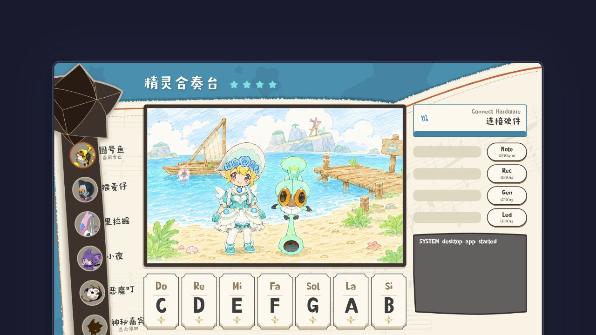
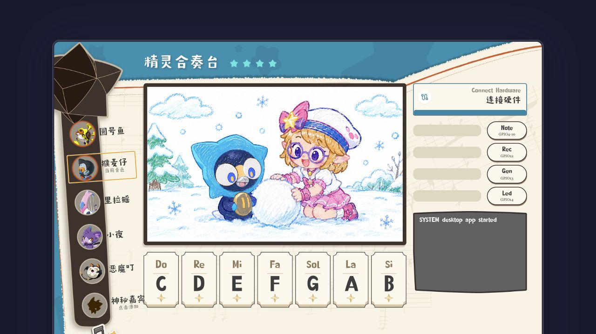
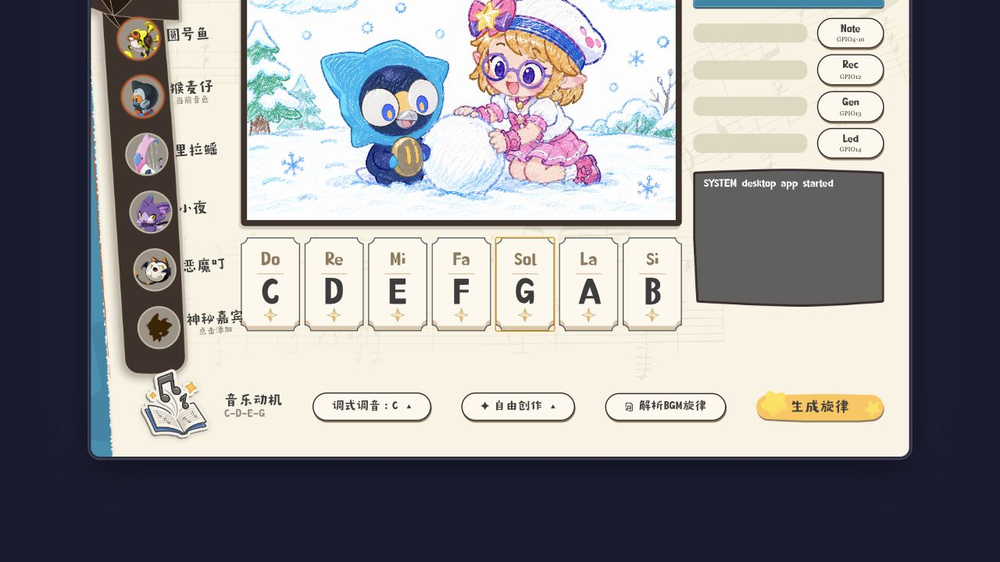
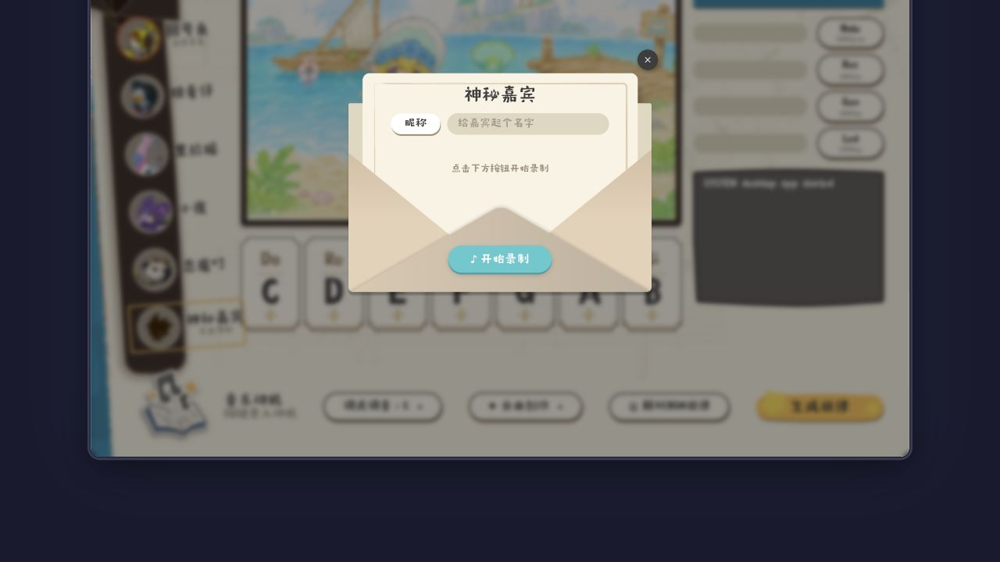
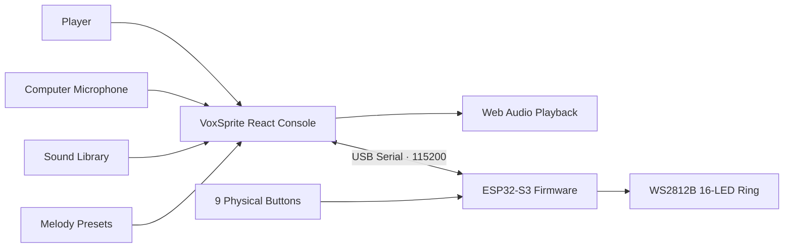
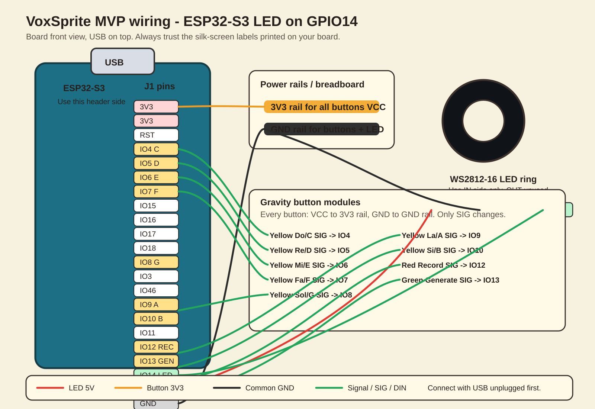
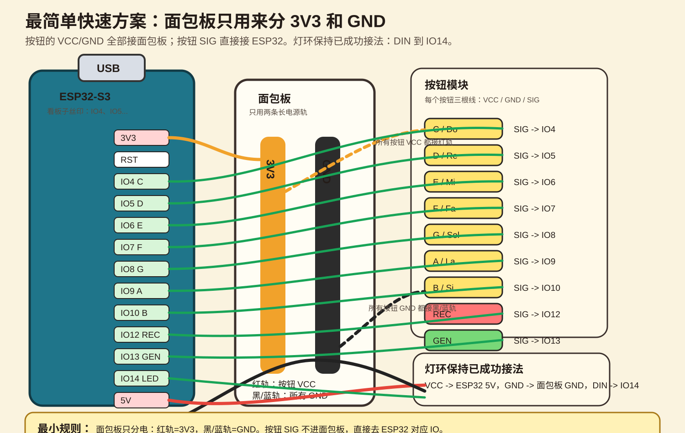
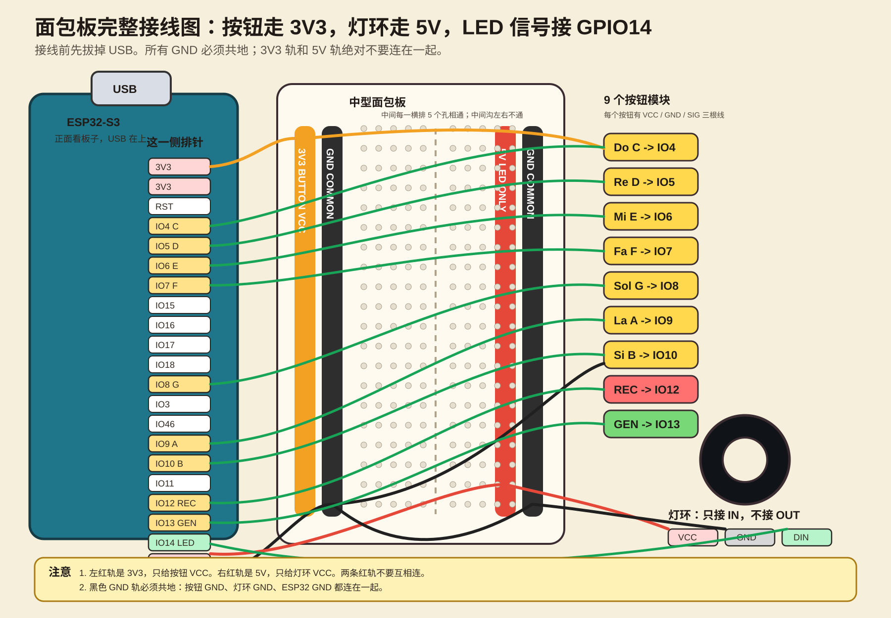

<div align="center">

<p>
  <a href="./README.md">简体中文</a> ·
  <strong>English</strong>
</p>


# VoxSprite

### Turn any voice into a playable sound sprite.

Give VoxSprite one short sound and it maps the sample across seven notes. Play it in the browser or through ESP32-S3 buttons, then watch a WS2812B LED ring answer every note in real time.

<p>
  <a href="https://github.com/Jackey0903/VoxSprite/stargazers"></a>
  
  
  
  
  
</p>

<p>
  <a href="#demo">Demo</a> ·
  <a href="#quick-start">Quick Start</a> ·
  <a href="#hardware">Hardware</a> ·
  <a href="#content-workflow">Content</a> ·
  <a href="#documentation">Docs</a>
</p>



</div>

## See It in One Line

```text
Choose or record a sound -> map it to C D E F G A B -> play on screen or hardware -> generate a phrase -> sync the LED ring
```

VoxSprite is more than an audio player. It is a complete interactive instrument that connects **sound sampling**, **pitch mapping**, **melody performance**, and **physical feedback**. The computer handles audio and the creative interface; the ESP32-S3 makes the experience tactile and visible.

## Why VoxSprite

`Vox` means voice; `Sprite` captures the small playable characters at the heart of the interface. Every recorded sound becomes a sprite with its own timbre, tuning, and performance identity.

| What you experience | What makes it work |
|---|---|
| Record one short syllable and play it across seven notes | Web Audio decoding, root-note calibration, pitch shifting, trimming, and gain |
| Switch sprites and change the instrument instantly | A data-driven multi-sample sound library |
| Enter a few notes and hear a complete phrase | Motif buffering, deterministic generation, and melody presets |
| Press a physical key and see the UI and LEDs react | Web Serial, ESP32-S3, nine-button input, and WS2812B state messages |
| Run the whole experience before hardware arrives | On-screen controls, keyboard shortcuts, and local recording fallbacks |

<a id="demo"></a>

## Demo

<table>
  <tr>
    <td width="50%"><br/><strong>Performance Console</strong><br/>Sprites, stage, notes, hardware controls, and serial logs share one focused view.</td>
    <td width="50%"><br/><strong>Playable Sprites</strong><br/>Switching characters changes the active sample, timbre, and stage state.</td>
  </tr>
  <tr>
    <td width="50%"><br/><strong>Motif to Melody</strong><br/>Recent notes become a motif that can expand into a repeatable phrase.</td>
    <td width="50%"><br/><strong>Bring Your Own Sound</strong><br/>Record a short sample on the spot and make it playable immediately.</td>
  </tr>
</table>

## What Works Today

- **One sound, seven notes**: map a short sample to `C D E F G A B`, including octave-aware and dual-sample ranges.
- **Multiple playable timbres**: configure root note, trim, gain, and playback behavior per sprite.
- **Motif-driven melodies**: play a short idea and expand it with stable local rules.
- **Preset performances**: define melody, tempo, velocity, octave, and optional backing audio.
- **Live sound capture**: record a new sample with the computer microphone and audition it immediately.
- **Three input paths**: use the UI, computer keyboard, or nine physical buttons through one action model.
- **Reactive light**: display notes, recording, generation, playback, rainbow, and off states.
- **Local-first operation**: no cloud backend, account, or external music-generation service is required.

<a id="quick-start"></a>

## Quick Start

### 1. Install and Run

You need Node.js 18+ and should use Chrome or Edge.

```bash
git clone https://github.com/Jackey0903/VoxSprite.git
cd VoxSprite/desktop-app
npm install
npm run dev
```

Open the local URL printed in the terminal. To match the current hardware handoff setup:

```bash
npm run dev -- --host 127.0.0.1 --port 5174
```

Then visit `http://127.0.0.1:5174/`.

> Safari can run the screen-only instrument, but it cannot connect to ESP32 because the hardware flow uses Web Serial.

### 2. Try It Without Hardware

1. Select a sprite timbre from the left sidebar.
2. Click `C D E F G A B`, or play notes with keyboard keys `1-7`.
3. Enter a short motif.
4. Click `生成旋律` to hear the expanded phrase.
5. Open `神秘嘉宾` to record and test your own sound.

### 3. Connect the Instrument

1. Connect the ESP32-S3 with a USB-C data cable.
2. Open VoxSprite in Chrome or Edge.
3. Click `Connect Hardware` and select the ESP32 serial port.
4. Press the physical buttons and confirm messages such as `IN NOTE:C`, `IN REC`, and `IN GENERATE` in the serial log.

## Architecture



The boundary is deliberate: **the computer handles sound; ESP32 handles physical interaction.** This keeps the MVP affordable, debuggable, and reliable in a live demo.

<a id="hardware"></a>

## Hardware

| Part | Quantity | Purpose |
|---|---:|---|
| ESP32-S3 DevKit | 1 | Reads buttons, drives LEDs, and connects to the browser over USB serial |
| Gravity / digital buttons | 9 | Seven notes + record + generate |
| WS2812B 16-LED ring | 1 | Shows notes and system state |
| Breadboard and jumper wires | 1 set | Fast assembly and wiring changes |
| USB-C data cable | 1 | Power and serial communication |

### Current Firmware Contract

| Action | Serial line or value |
|---|---|
| Note buttons | `NOTE:C` / `NOTE:D` / `NOTE:E` / `NOTE:F` / `NOTE:G` / `NOTE:A` / `NOTE:B` |
| Record | `REC` |
| Generate | `GENERATE` |
| LED data pin | `GPIO14` |
| Baud rate | `115200` |

| GPIO14 LED Wiring | Simple Breadboard MVP | Full Breadboard Reference |
|---|---|---|
|  |  |  |

Firmware lives in `firmware/esp32-s3-controller/`:

```bash
cd firmware/esp32-s3-controller
pio run
pio run --target upload
```

Disconnect the browser from the serial port before uploading firmware.

<a id="content-workflow"></a>

## Content Workflow

Sounds and melodies stay separate from core implementation so content work can happen independently:

| Content | Location |
|---|---|
| Sound files | `desktop-app/public/sounds/` |
| Sound registry | `desktop-app/src/content/soundLibrary.ts` |
| Melody presets | `desktop-app/src/content/presetMelodies.ts` |

Recommended sample format:

| Field | Recommendation |
|---|---|
| Format | `.wav` preferred; `.mp3`, `.webm`, and `.ogg` accepted |
| Sample rate | 44.1 kHz or 48 kHz |
| Channels | Mono preferred |
| Length | 0.3-1.2 seconds ideal, no more than 3 seconds |
| Content | One clear syllable, clean attack, little background noise, no long reverb tail |

```ts
// desktop-app/src/content/soundLibrary.ts
{
  id: 'cat-meow',
  name: 'Cat Meow',
  file: '/sounds/cat-meow-c4.wav',
  baseNote: 'C',
  trimStartMs: 20,
  trimEndMs: 780,
  gain: 0.85,
  enabled: true,
  tags: ['animal', 'bright']
}
```

Melody events remain compact and reviewable:

```ts
{ note: 'C', durationMs: 240, velocity: 0.95 }
```

## Repository Map

```text
VoxSprite/
├── desktop-app/                     # Vite + React performance console
│   ├── public/sounds/               # Samples and backing tracks
│   └── src/content/                 # Timbre and melody configuration
├── firmware/esp32-s3-controller/    # ESP32-S3 / PlatformIO firmware
├── docs/                            # Wiring, protocol, and team handoff docs
├── docs/screenshots/                # Real interface screenshots for the README
└── DFRobot 完整采购清单.md           # MVP hardware purchase list
```

## Validation

```bash
cd desktop-app
npm run build
```

```bash
cd firmware/esp32-s3-controller
pio run
```

A complete demo means the web notes produce sound, custom recording works, ESP32 emits `NOTE:*` / `REC` / `GENERATE`, and the LED ring responds to `LED:*` messages.

<a id="documentation"></a>

## Documentation

| Document | What it covers |
|---|---|
| [MVP scope](docs/MVP_SCOPE.md) | Included and deferred features |
| [Implementation plan](docs/IMPLEMENTATION_PLAN.md) | Engineering plan and implementation notes |
| [Serial protocol](docs/SERIAL_PROTOCOL.md) | Exact USB serial messages |
| [Hardware wiring](docs/HARDWARE_WIRING.md) | Standard wiring reference |
| [Hardware handoff CN](docs/HARDWARE_INTERFACE_HANDOFF_CN.md) | Actual demo wiring and reasons behind code changes |
| [Content handoff](docs/CONTENT_HANDOFF.md) | Sound and melody data formats |
| [Team split CN](docs/TEAM_SPLIT_CN.md) | Collaboration workflow and shared parameters |

## Project Boundaries

VoxSprite began as a XiaoHongShu AI Builder project and is currently a local-first, demo-ready MVP. It does not require a cloud backend, accounts, Bluetooth, an SD card, an amplifier, or a hardware speaker. Melody generation uses reproducible local rules and presets; the project does not claim to run a full AI music model.

Do not publicly redistribute unlicensed game audio or character assets. Prefer original, team-recorded, or explicitly licensed material for new content.

---

<div align="center">

**VoxSprite** — Record one sound. Let it play.

</div>
